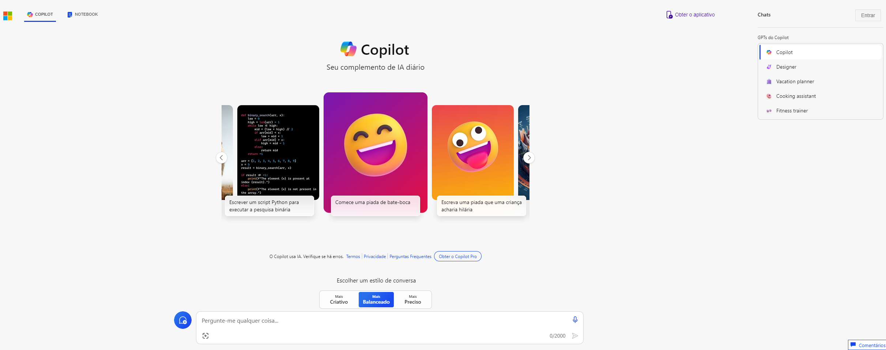
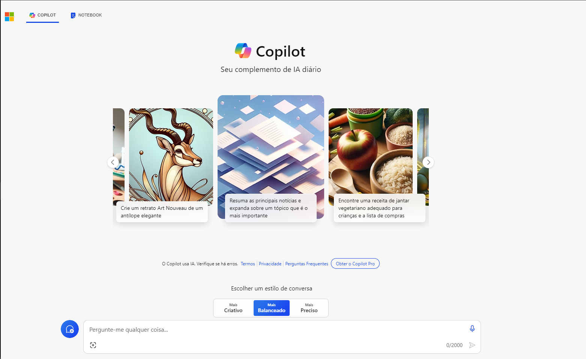
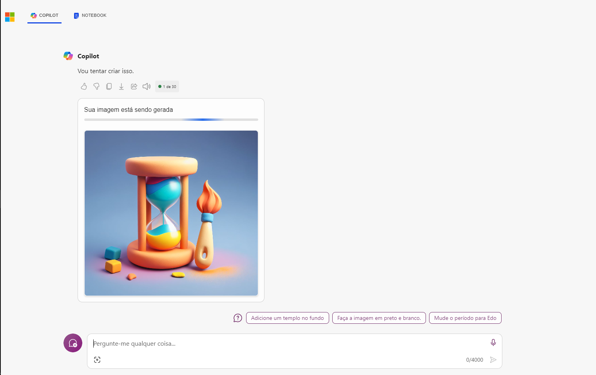
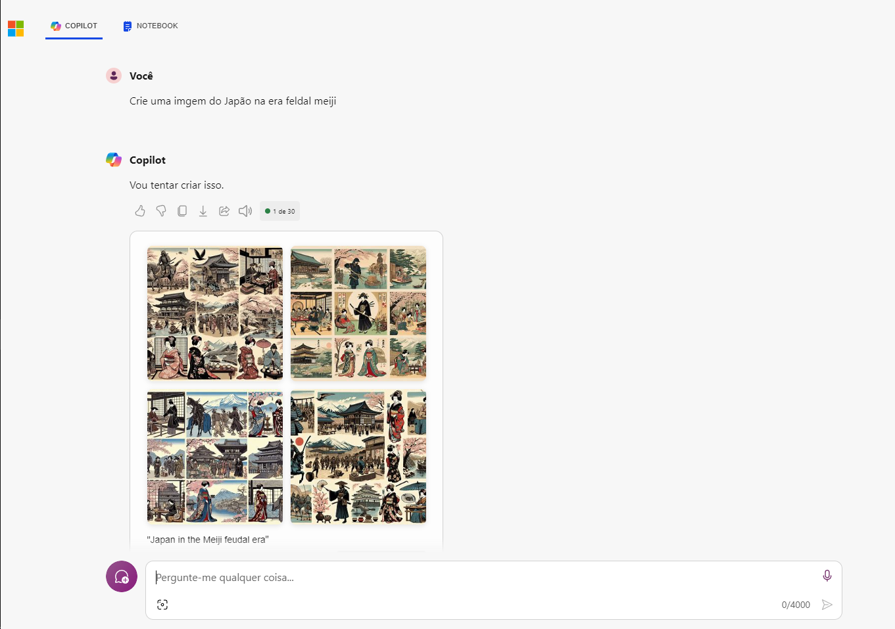

# Azure-AI-Generativa
## Azure OpenAI Service brings the generative AI models developed  

Nesse documento vou demonstrar o funcionamento do Microsoft copilot

Acesse o link [copilot](https://copilot.microsoft.com/)

Faca o login

Dentro do copilot no final da pagina voce possui uma opcao de selecionar um estilo da conversa

Na label ao final da pagina insira o conteudo que deseja que o copilot execute

No meu caso eu pedi que gerasse uma imagem do Japao na era meiji

Gerando a imagem

