# Azure-AI-Search

> [!NOTE]
> O passo a passo é a partir da criação dos recurso, não antes disso.

>[!WARNING]
>Documentacao para preenchimento (https://microsoftlearning.github.io/mslearn-ai-fundamentals/Instructions/Labs/11-ai-search.html)

Acesse o link [speech](https://speech.microsoft.com/)

## Faca o login

Na categoria AI + machine learning 

Selecione Azure AI Studio
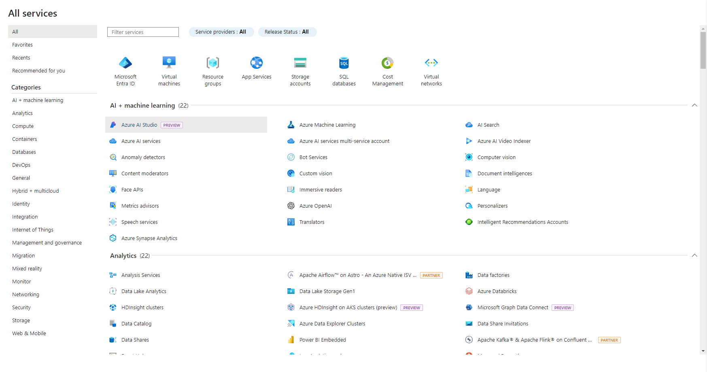

No cabecalho selecione a opcao **+ Create**
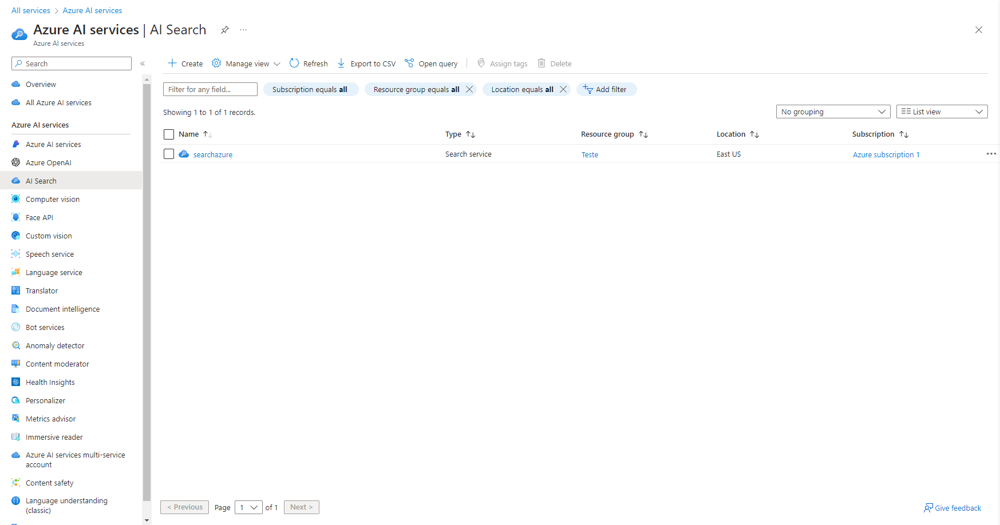

Preencha os campos conforme a documentacao
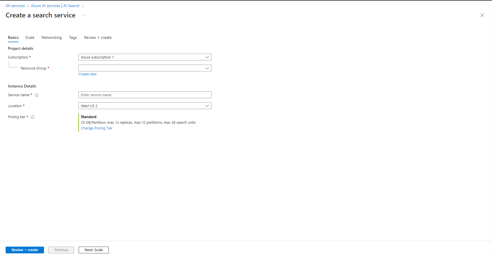

> [!NOTE]
> A opcao deve ser a **BASIC**
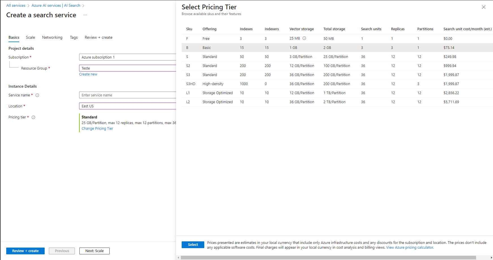

De volta ao home na aba lateral selecione **+ Create a resource**

Selecione **Azure AI Service**
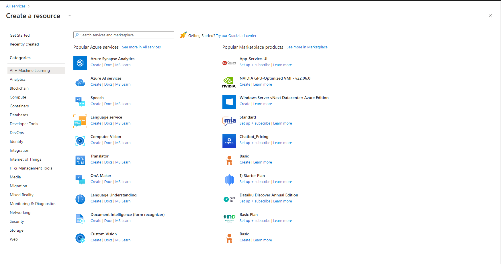

Crie o servico conforme a documentacao
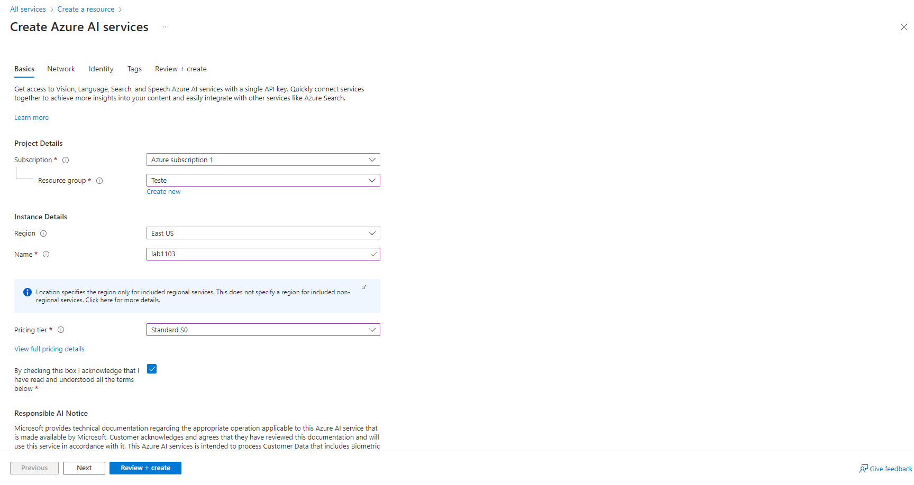

Verifique se na home do Servico foi criado
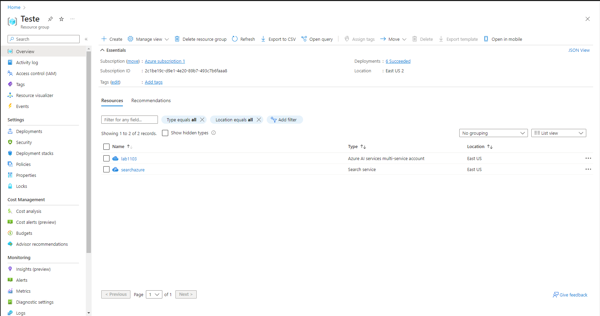

De volta ao home na aba lateral selecione **Storage Account**
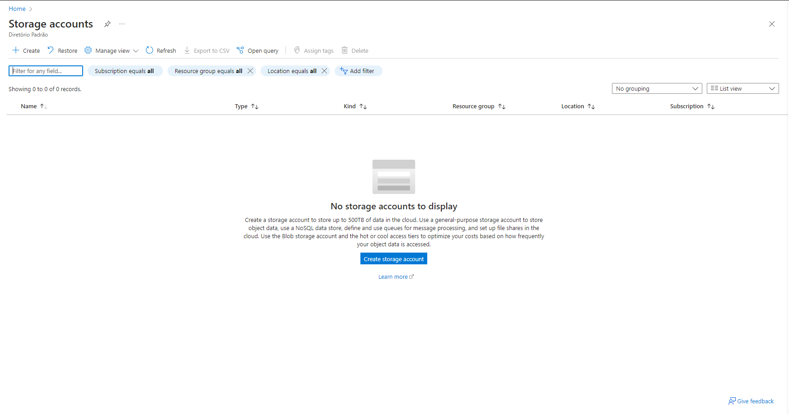

Seelcione Create preencha os campos conforme a documentacao
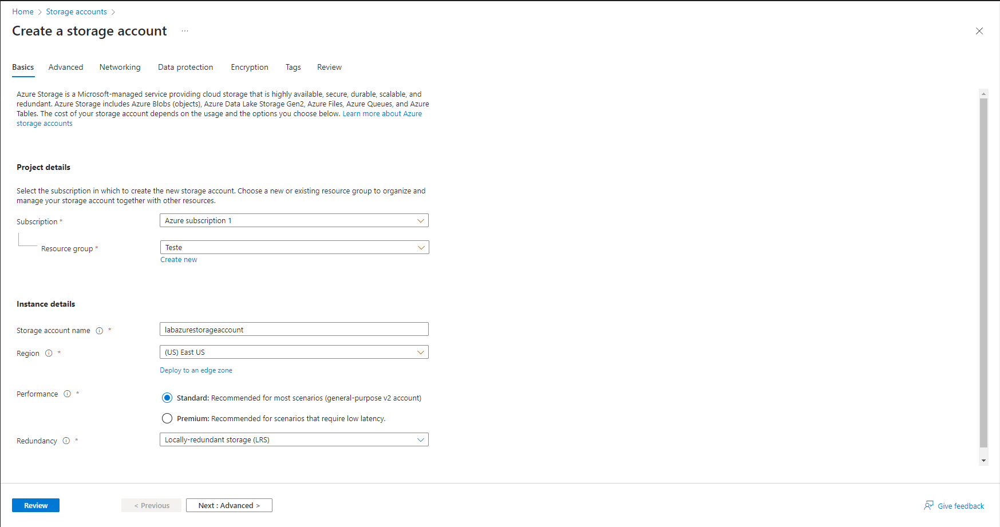

Verifique se na home do Storage foi criado
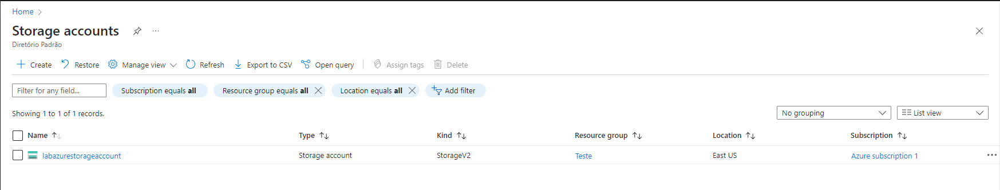

Selecione o storage que voce criou

Na opcao que ira apresentar, preencha os campos conforme a documentacao
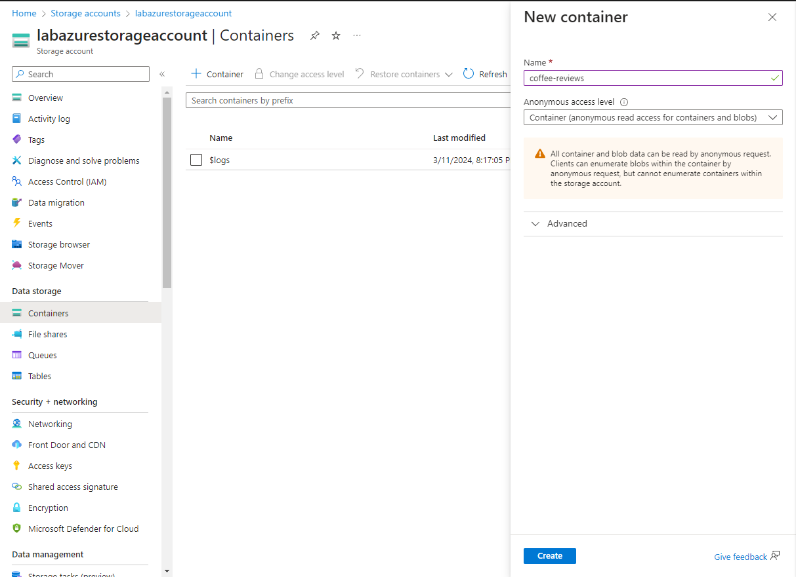

> [!NOTE]
> Nas configuracoes habilite a opcao **Allow Blob anonymous**

> Conforme a imagem
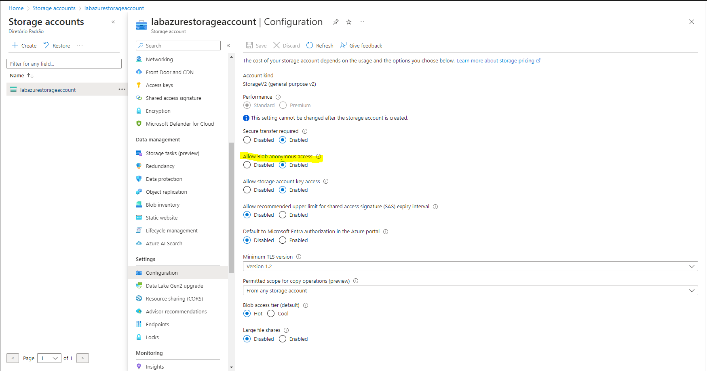

Em uma nova guia do navegador, baixe **zipped coffee reviews** e extraia os arquivos para a pasta de avaliações.

No portal do Azure, selecione o **coffe-reviews** contêiner. No contêiner, selecione **Upload**.
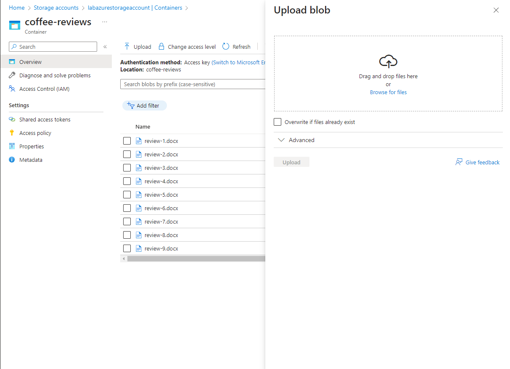
