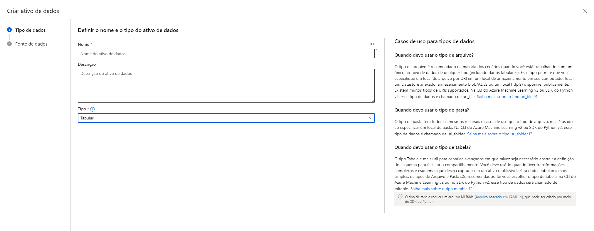

# Explorando automacao Machine Learning no Azure Machine Learning

> [!NOTE]
> O passo a passo é a partir da criação do workspace, não antes disso.


Criando uma workspace





> [!IMPORTANT]
> Esse processo pode demorar um pouco.


Pipeline com os processos 


Teste de modelo
Nessa etapa eu tive que criar meu modelo, não sei por que ele não criou


## Deploy do servico

Agora você pode testar seu serviço implantado.

No estúdio Azure Machine Learning, no menu esquerdo, selecione Endpoints e abra o ponto final em tempo real de previsão de alugueres.

Na página do endpoint em tempo real de previsão de aluguel, visualize a guia Teste.

No painel Dados de entrada para testar o endpoint, substitua o modelo JSON pelos seguintes dados de entrada:

```
   {
   "Inputs": { 
     "data": [
       {
         "day": 1,
         "mnth": 1,   
         "year": 2022,
         "season": 2,
         "holiday": 0,
         "weekday": 1,
         "workingday": 1,
         "weathersit": 2, 
         "temp": 0.3, 
         "atemp": 0.3,
         "hum": 0.3,
         "windspeed": 0.3 
       }
     ]    
   },   
   "GlobalParameters": 1.0
 }
```

Clique no botão Testar.

Revise os resultados do teste, que incluem um número previsto de aluguéis com base nos recursos de entrada - semelhante a este:

```
 {
   "Results": [
     444.27799000000000
   ]
 }
```