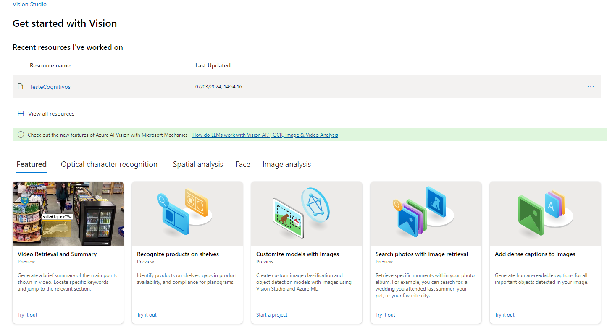
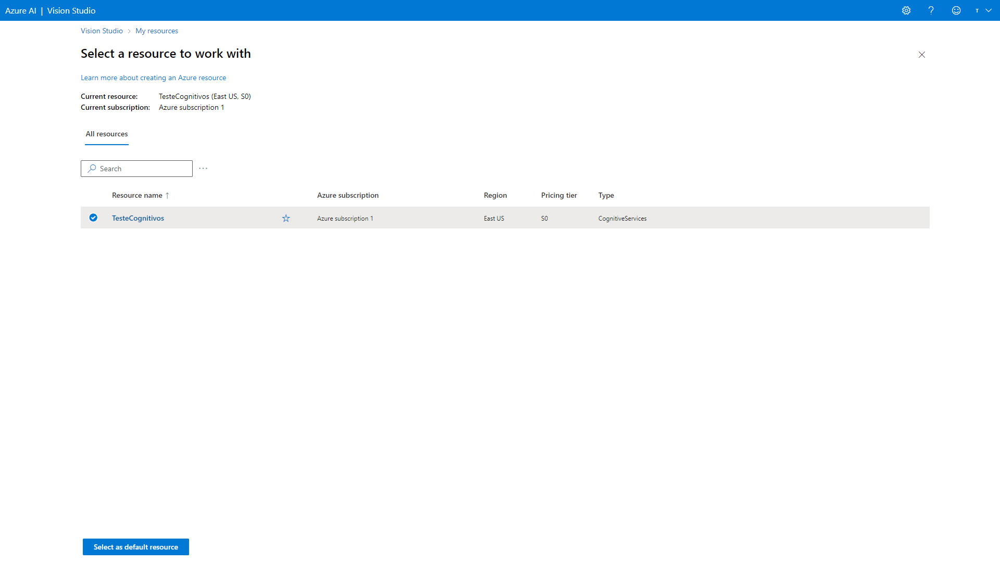
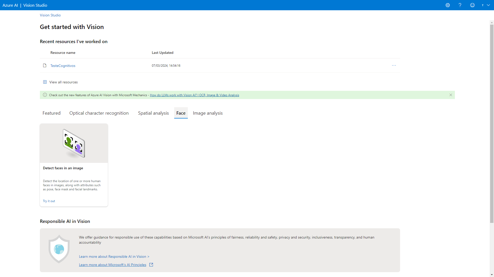
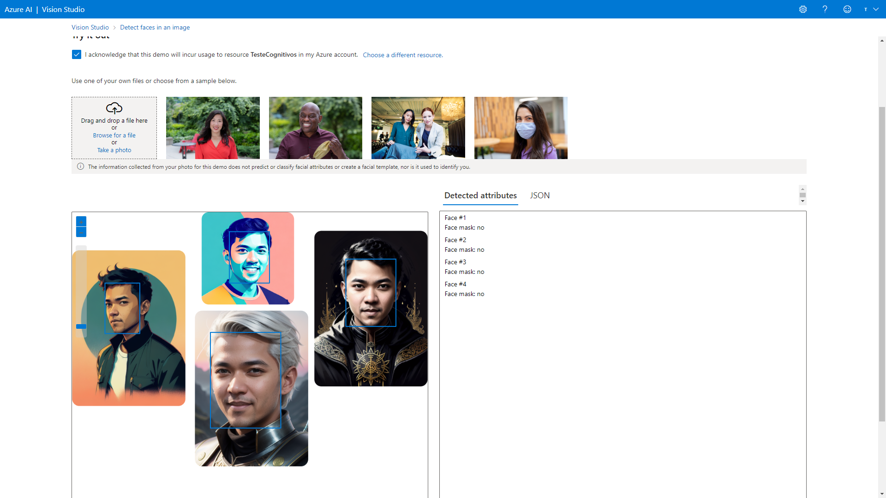
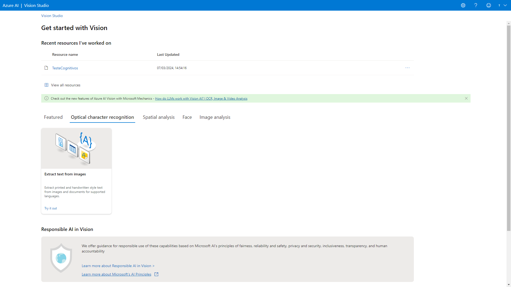
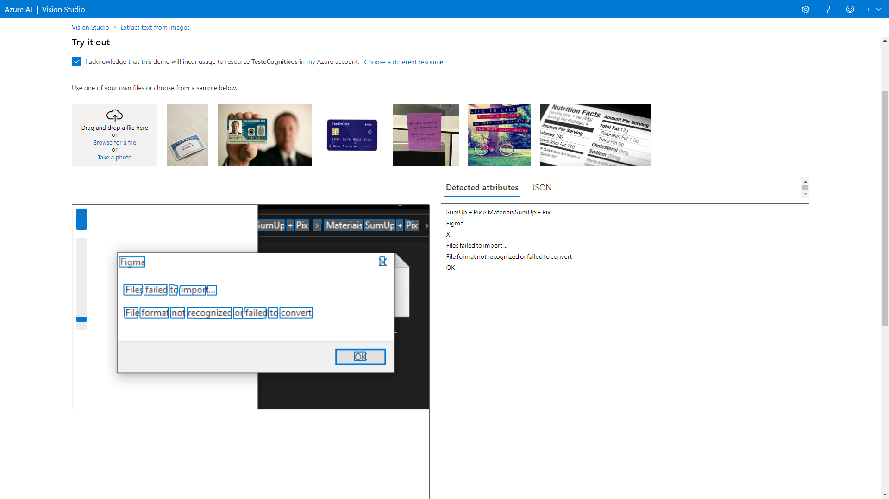
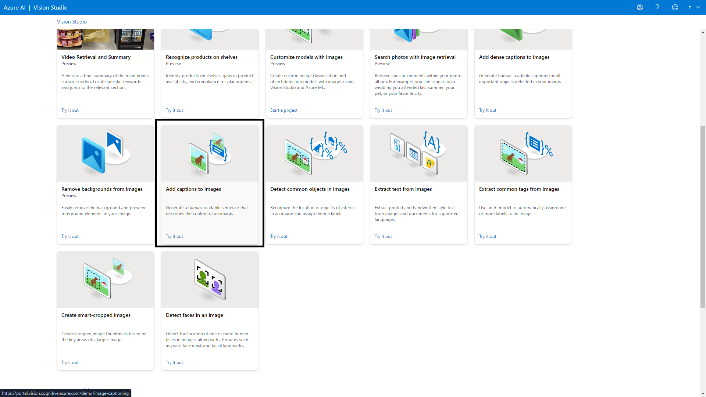
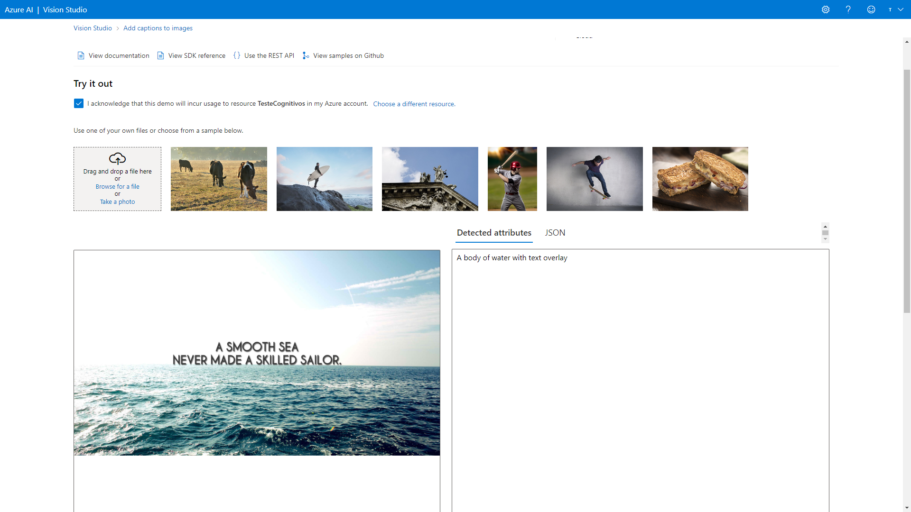

# Reconhecimento facial e transformacao de imagens em Dados no Azure ML

> [!NOTE]
> O passo a passo é a partir da criação dos recurso, não antes disso.

Criando uma workspace

Acesse o link [Vision](https://portal.vision.cognitive.azure.com/)

## Faca o login

Click em **View all resources**

Para selecionar o recurso

Selecione o recurso que vai utilizar

Pressione o botao **Select as default resource**

No canto superior direito preciose o **X**

### Na aba **Face** 

Selecione o card **Detect faces in an image**

> [!IMPORTANT]
> Em todos processos de extracao.
> No texto **Try it out**
> Deixe selecionado

Faca o drop da imagem 

### Na aba **Optical character recognition**

Selecione o card **Extract text from images**

Faca o drop da imagem 

### Na aba **Featured**

Selecione o card **Add captions to images**

Faca o drop da imagem 

