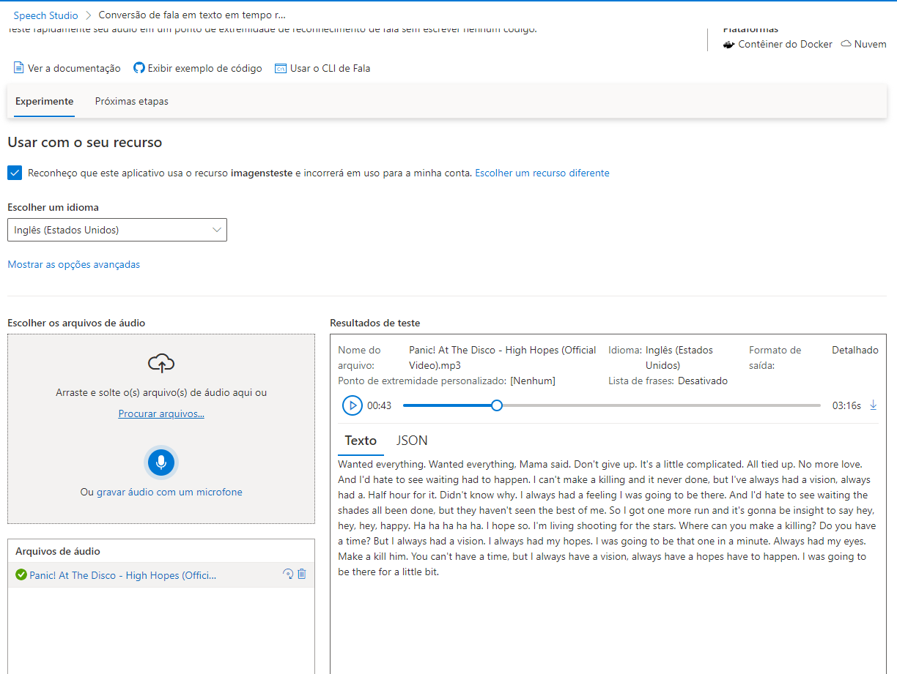

# Azure-Speech-Studio

> [!NOTE]
> O passo a passo é a partir da criação dos recurso, não antes disso.

Acesse o link [speech](https://speech.microsoft.com/)

## Faca o login

Click na engrenagem no canto superior direito

Selecione o recurso **Ja foi criado**

Click no XIS no canto superior direito

Utilize o scroll do mouse para descer ate o texto **Conversao de fala em texto** e selecione o card **Conversao de fala em texto em tempo real**

Selecione o idioma que vai converter

Depois selecione o check box **Reconheco que este aplicativo...**

Selecioine o audio ou grave um audio e da play 

# Azure-Language-Studio

## Quantas pessoas estao felizes com o texto que estou inserindo